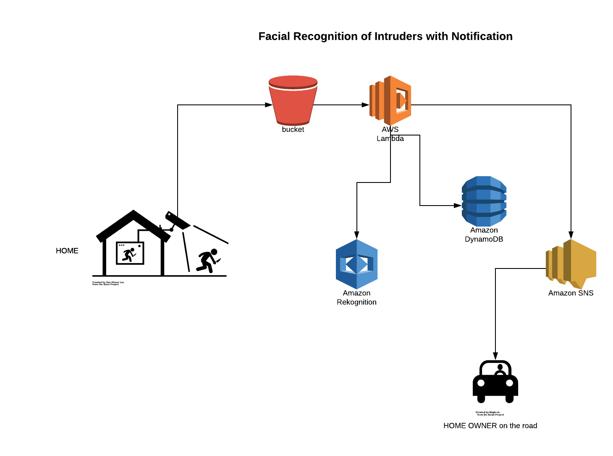

Intruper
=======

Description
-----------

This project is developed as a prototype to demonstrate how various cloud services can be used together to build a facial detection system for home security. There are some assumptions to this system: 

1. Security camera offers motion detection alarm capability
2. Security camera can send an email to any given email account when a motion alert is generated
3. Security camera can capture an image or a series of images that can be included in the email alert
4. The alerted email will contain the images generated by capturing the scene

Given the above assumptions, here is the high level view of the system design:

Most security cameras offer the above capabilities, some more, some less. Here is the specific camera equipment used in this prototype:

[Amcrest ProHD Fixed Outdoor 1.3 Megapixel Wi-Fi Vandal Dome IP Security Camera]("https://www.amazon.com/gp/offer-listing/B0779JKZJD/ref=as_li_tl?ie=UTF8&camp=1789&creative=9325&creativeASIN=B0779JKZJD&linkCode=am2&tag=techwithjava-20&linkId=bed5afc4896955fce81a691bf385b309")

Execution Flow
--------------

How to build intruper ?
----------------------
<code>
$ gradle build
</code>

How to deploy intruper to ElasticBeanStalk ? 
-------------------------------------------
For details refer to this page on [AWS](https://docs.aws.amazon.com/elasticbeanstalk/latest/dg/eb-cli3.html)

<code>
eb create intruper-dev-env
</code>

<code>
aws elasticbeanstalk create-application-version --application-name intruper --version-label intruper-0.1.0 --source-bundle S3Bucket=<public bucket>,S3Key=<key>
</code>

How to run intruper ?
---------------------
<code>
$ SPRING_PROFILES_ACTIVE=production java -jar application.jar
</code>

<code>
$ AWS_REGION="us-east-1" AWS_ACCESS_KEY=<>  AWS_SECRET_ACCESS_KEY=<> SPRING_PROFILES_ACTIVE=production java -jar application-0.1.0.jar
</code>

How to manually copy the jar file?
----------------------------------
<code>
scp -i ~/"<pem>" build/libs/application-0.1.0.jar ec2-user@<ec2-address>.compute-1.amazonaws.com:
application-0.1.0.jar 
</code>

To Dos
------

1. Need admin console to administer customers
2. Need to automate onboarding of a new customer
3. Need to build cloudformation templates to standup the infrastructure
4. Need to build testing infrastructure

