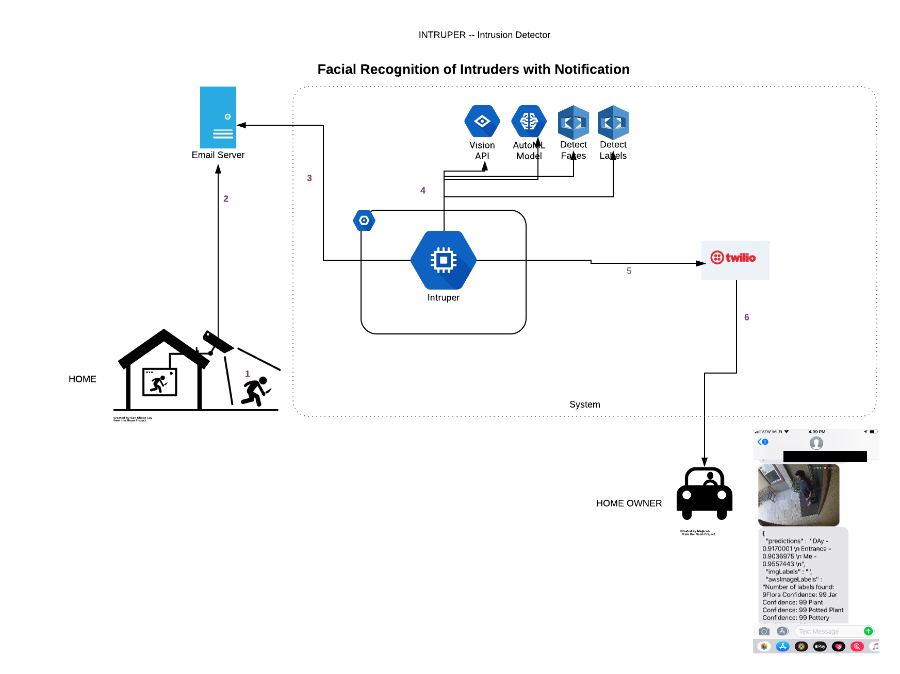
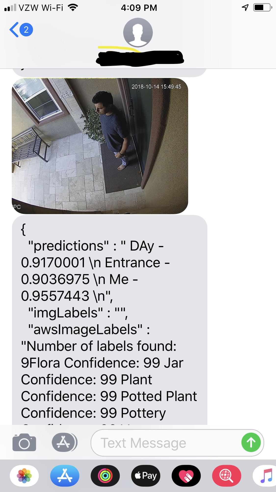
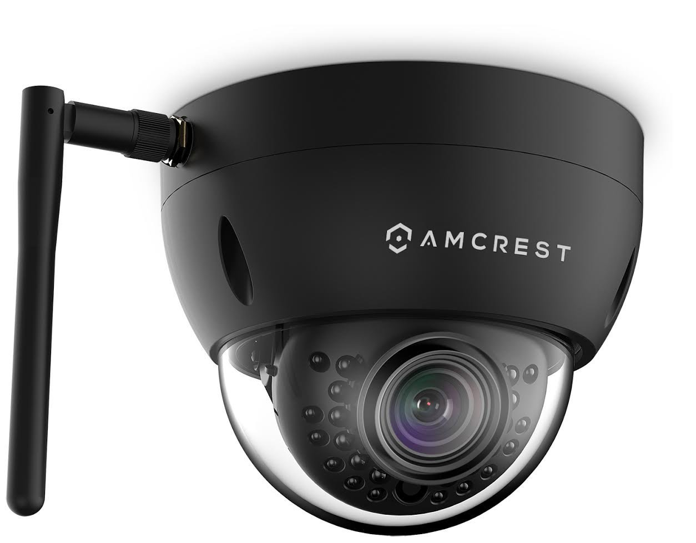

Intruper
=======

Use case
--------
Someone comes to my front door and using motion detection my front door camera snaps a picture and emails the image as an attachment for intrusion detection.

Description
-----------
First & foremost I want to say thank you for taking the time to look over my project - I hope you will get something useful out of this. Also, please note that this is ***work in progress***.
This project is developed as a prototype to demonstrate how various cloud services can be used together to build a facial detection system for home security. There are some assumptions to this system: 

1. Security camera offers motion detection alarm capability
2. Security camera can send an email to any given email account when a motion alert is generated
3. Security camera can capture an image or a series of images that can be included in the email alert
4. The alerted email will contain the images generated by capturing the scene

Given the above assumptions, here is the high level view of the system design:

Execution Flow
--------------
Intruper application running is a spring boot micro-service that is periodically checking the email and once a new email is received it performs the following steps:

1. An intruder triggers motion detection on the camera
2. Camera snaps a picture and emails it
3. Intruper is periodically checking the email and retrieves the email from the server and looks for image attachments
4. If an image is detected, it calls four APIs in parallel:
    1. Google's Vision API
    1. A custom trained model version in Google's AutoML service
    1. AWS Rekognition detect labels API
    1. AWS Rekognition detect faces API the prediction API for a model deployed in Google's 
5. Intruper takes the output from all the four APIs calls Twillio's API to send an SMS message
6. Last, Twilio sends a message with the  image and meta-data collected from prediction, detect labels and detect faces APIs to my phone

You can see in the snapshot in right bottom corner the actual SMS I received along with the image and the body of the message. Here is the detailed out message body:

Here is the full screenshot from my phone:

Here is the full body of the message:
<code>
{ 
  "predictions" :  
   &nbsp;&nbsp;&nbsp;&nbsp;&nbsp;&nbsp;"DAy - 0.9170001 
   &nbsp;&nbsp;&nbsp;&nbsp;&nbsp;&nbsp; Entrance - 0.903697 
    &nbsp;&nbsp;&nbsp;&nbsp;&nbsp;&nbsp;Me - 0.9557443",  
  "imgLabels" : "", 
  "awsImageLabels" : "Number of labels found: 9 
  &nbsp;&nbsp;&nbsp;&nbsp;&nbsp;&nbsp;  Flora Confidence: 99  
   &nbsp;&nbsp;&nbsp;&nbsp;&nbsp;&nbsp; Jar Confidence: 99  
    &nbsp;&nbsp;&nbsp;&nbsp;&nbsp;&nbsp;Plant Confidence: 99  
    &nbsp;&nbsp;&nbsp;&nbsp;&nbsp;&nbsp;Potted Plant Confidence: 99  
    &nbsp;&nbsp;&nbsp;&nbsp;&nbsp;&nbsp;Pottery Confidence: 99  
    &nbsp;&nbsp;&nbsp;&nbsp;&nbsp;&nbsp;Vase Confidence: 99  
    &nbsp;&nbsp;&nbsp;&nbsp;&nbsp;&nbsp;Human Confidence: 98  
    &nbsp;&nbsp;&nbsp;&nbsp;&nbsp;&nbsp;People Confidence: 98  
    &nbsp;&nbsp;&nbsp;&nbsp;&nbsp;&nbsp;Person Confidence: 98 ", 

  "resultingMetaData" : { 
    &nbsp;&nbsp;&nbsp;&nbsp;&nbsp;&nbsp;" Facial features of : 1   
    &nbsp;&nbsp;&nbsp;&nbsp;&nbsp;&nbsp;&nbsp;&nbsp;&nbsp;&nbsp;&nbsp;&nbsp;    Age range:  
     &nbsp;&nbsp;&nbsp;&nbsp;&nbsp;&nbsp;&nbsp;&nbsp;&nbsp;&nbsp;&nbsp;&nbsp;&nbsp;&nbsp;&nbsp;&nbsp;&nbsp;&nbsp;{Low: 19,High: 36}  
     &nbsp;&nbsp;&nbsp;&nbsp;&nbsp;&nbsp;&nbsp;&nbsp;&nbsp;&nbsp;&nbsp;&nbsp;   Gender:  
     &nbsp;&nbsp;&nbsp;&nbsp;&nbsp;&nbsp;&nbsp;&nbsp;&nbsp;&nbsp;&nbsp;&nbsp;&nbsp;&nbsp;&nbsp;&nbsp;&nbsp;&nbsp;{Value: Female,Confidence: 99.8783}  
     &nbsp;&nbsp;&nbsp;&nbsp;&nbsp;&nbsp;&nbsp;&nbsp;&nbsp;&nbsp;&nbsp;&nbsp;   Beard:  
     &nbsp;&nbsp;&nbsp;&nbsp;&nbsp;&nbsp;&nbsp;&nbsp;&nbsp;&nbsp;&nbsp;&nbsp;&nbsp;&nbsp;&nbsp;&nbsp;&nbsp;&nbsp;{Value: true,Confidence: 99.74808}  
     &nbsp;&nbsp;&nbsp;&nbsp;&nbsp;&nbsp;&nbsp;&nbsp;&nbsp;&nbsp;&nbsp;&nbsp;Emotions: [ 
     &nbsp;&nbsp;&nbsp;&nbsp;&nbsp;&nbsp;&nbsp;&nbsp;&nbsp;&nbsp;&nbsp;&nbsp;&nbsp;&nbsp;&nbsp;&nbsp;&nbsp;&nbsp;
     {Type: SURPRISED,Confidence: 10.521418},  
     &nbsp;&nbsp;&nbsp;&nbsp;&nbsp;&nbsp;&nbsp;&nbsp;&nbsp;&nbsp;&nbsp;&nbsp;&nbsp;&nbsp;&nbsp;&nbsp;&nbsp;&nbsp;
     {Type: ANGRY,Confidence: 9.073746},  
     &nbsp;&nbsp;&nbsp;&nbsp;&nbsp;&nbsp;&nbsp;&nbsp;&nbsp;&nbsp;&nbsp;&nbsp;&nbsp;&nbsp;&nbsp;&nbsp;&nbsp;&nbsp;
     {Type: SAD,Confidence: 8.3601}]" :  
     &nbsp;&nbsp;&nbsp;&nbsp;&nbsp;&nbsp;{ 
     &nbsp;&nbsp;&nbsp;&nbsp;&nbsp;&nbsp;&nbsp;&nbsp;&nbsp;&nbsp;&nbsp;&nbsp; "width" : 0.06875, 
     &nbsp;&nbsp;&nbsp;&nbsp;&nbsp;&nbsp;&nbsp;&nbsp;&nbsp;&nbsp;&nbsp;&nbsp; "height" : 0.09166667, 
     &nbsp;&nbsp;&nbsp;&nbsp;&nbsp;&nbsp;&nbsp;&nbsp;&nbsp;&nbsp;&nbsp;&nbsp; "left" : 0.45625, 
     &nbsp;&nbsp;&nbsp;&nbsp;&nbsp;&nbsp;&nbsp;&nbsp;&nbsp;&nbsp;&nbsp;&nbsp; "top" : 0.15833333 
    &nbsp;&nbsp;&nbsp;&nbsp;&nbsp;&nbsp;} 
  &nbsp;&nbsp;&nbsp;&nbsp;&nbsp;&nbsp;}, 
  "error" : null 
}
</code>

Most security cameras offer the above capabilities, some more, some less. Here is the specific camera equipment used in this prototype:

[Amcrest ProHD Fixed Outdoor 1.3 Megapixel Wi-Fi Vandal Dome IP Security Camera]("https://www.amazon.com/gp/offer-listing/B0779JKZJD/ref=as_li_tl?ie=UTF8&camp=1789&creative=9325&creativeASIN=B0779JKZJD&linkCode=am2&tag=techwithjava-20&linkId=bed5afc4896955fce81a691bf385b309")

#Build & Deploy

### How to build intruper ?

<code>
$ gradle clean build
</code>

###How to run intruper ?

<code>
$ AWS_REGION="us-east-1" AWS_ACCESS_KEY=<>  AWS_SECRET_ACCESS_KEY=<> SPRING_PROFILES_ACTIVE=production java -jar application-0.1.0.jar
</code>

##Deploy to AWS ElasticBeanStalk

### How to deploy intruper to ElasticBeanStalk ? 

For details refer to this page on [AWS](https://docs.aws.amazon.com/elasticbeanstalk/latest/dg/eb-cli3.html)

<code>
eb create intruper-dev-env
</code>
 
 
<code>
aws elasticbeanstalk create-application-version --application-name intruper --version-label intruper-0.1.0 --source-bundle S3Bucket=<public bucket>,S3Key=<key>
</code>

### How to manually copy the jar file?

<code>
scp -i ~/"<pem>" build/libs/application-0.1.0.jar ec2-user@<ec2-address>.compute-1.amazonaws.com:
application-0.1.0.jar 
</code>

### Deploy to Google Compute

#### How to connect?

<code>
gcloud compute --project "" ssh --zone "us-central1-c" "app-instance"
</code>
 

#### How to copy files to your instance?

<code>
gcloud compute scp build/libs/application-0.1.0.jar app-instance: 
</code>
 

####How to run the app?
 
<code>
AWS_REGION="us-east-1" AWS_ACCESS_KEY=  AWS_SECRET_ACCESS_KEY= SPRING_PROFILES_ACTIVE=production java -jar application-0.1.0.jar &
</code>

### NOTE
You can build your own model using Google AutoML, here are some links:

- [Getting Started with Google AI & ML](https://cloud.google.com/ml-engine/docs/tensorflow/getting-started-training-prediction?_ga=2.133596747.-452844365.1517727035&_gac=1.117566203.1535770353.CjwKCAjwzqPcBRAnEiwAzKRgS4AOLg5sf80lQ4-Ykc6ij1567UI-R-bC3j07FtpbqC-og2dPSyZJ3RoCtdwQAvD_BwE)

- [AutoML Vision Beginner's Guide](https://cloud.google.com/vision/automl/docs/beginners-guide#evaluate)

- [AutoML Natural Language API Tutorial](https://cloud.google.com/natural-language/automl/docs/tutorial)

- [AutoML Vision API Tutorial](https://cloud.google.com/vision/automl/docs/tutorial)

Also, you will need to modify/update [applicationl.yml](src/main/resources/application.yml) with values from your environment to make it work
To send/receive messages using Twilio, update the [SMSProcessor.java](src/main/java/com/zomasystems/processors/SMSProcessor.java) with your id and token.